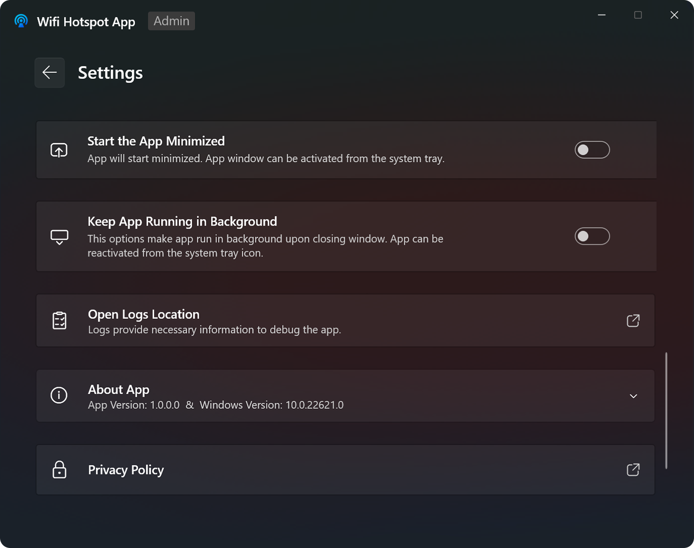
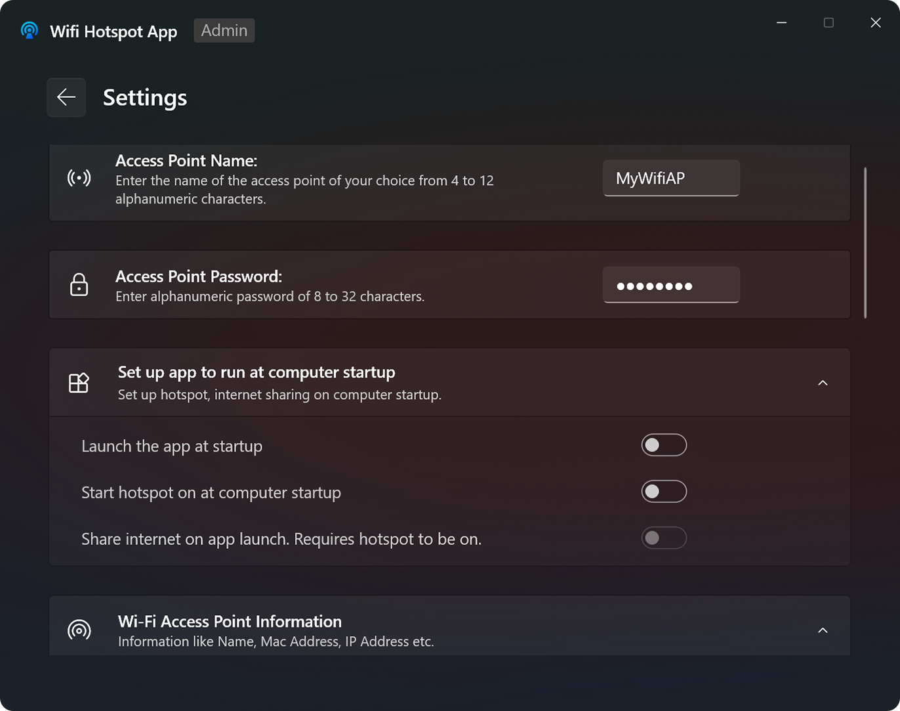
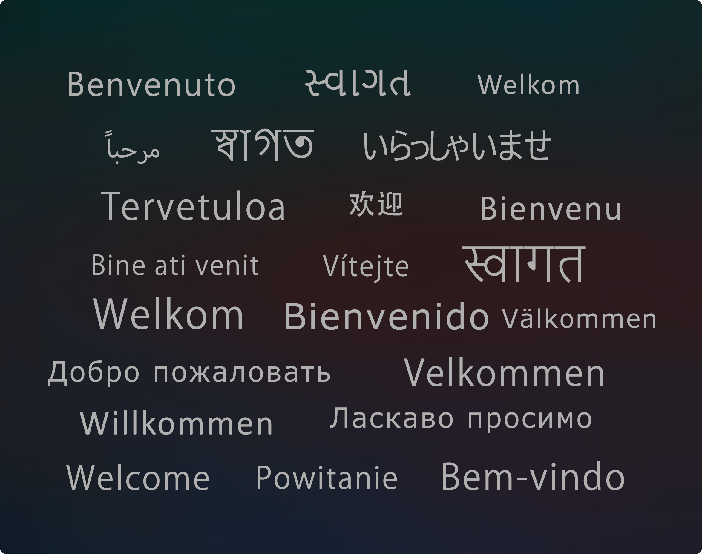

  
  <h1 align="center">Wifi Hotspot App</h1>

This is the public repository of Wifi Hotspot App on Microsoft Store. You can discuss, request feature or inform issues in the app.

### About App
This is a modern Minimalistic App to create and manage Wi-Fi Hotspot with/without having Internet.

### Features:
- Enable and Disable Internet while hotspot is ON.
- Get information about devices connected to hotspot.
- Configure the app to run at windows startup, enable internet sharing.
- Keep the app running in background.
- Supports 25 Languages.

### Download From MS Store:

### Localization (Translation):

### Screenshots

    
    
      
    
    
      
       

